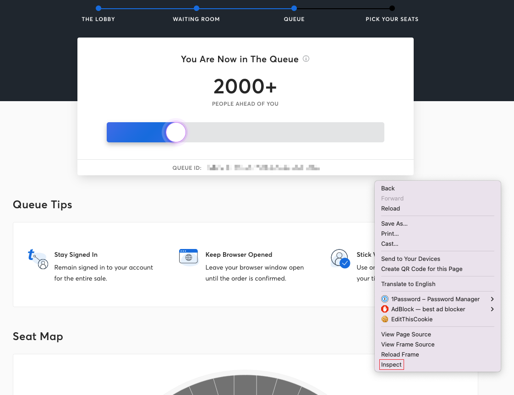
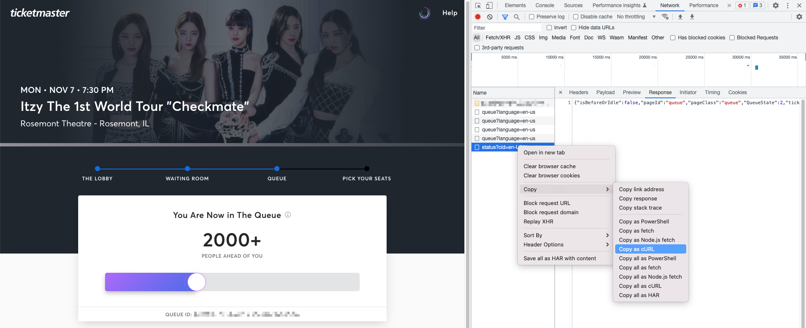

# Peek the Ticketmaster Line

## Why?

Ticketmaster's queue will NOT tell your position of the queue when your position is 2000+ and this project allow you to peek your actural position from the queue and expected time of your turn.

## How to make it work?

### Step 1: Get the Project

```
$ git clone https://github.com/fanfannnmn/peek_the_tm_line.git
$ cd peek_the_tm_line.git
```

### Step 2: Get cURL Commands

#### Open Inspect Panel

Once you reached the either **Waiting Room** or **Queue** pages, right click the page then click **Inspect** to open Inspect Panel.



#### Copy as cURL

Goto **Network** Tab and wait for few seconds until you find an item looks like `status?language=xx-xx` then right click it then **Copy -> Copy as cURL**

Command shuold looks like:

```
curl 'https://queue.ticketmaster.com/spa-api/queue/ticketmaster/...
```



#### Place into `commands` Directory

Once you copied the cURL command, you need to create a file under `commands` directory and paste the cURL command copied from last step to this file.

For instance:

```
$ touch commands/ITZY_Rosemont_IL    # create an empty file
$ nano commands/ITZY_Rosemont_IL     # open the file with nano and paste from click board
```

### Step 3: Time to Peek

```
$ python3 main.py
```

#### Result should looks like:

```
>>> ITZY_Rosemont_IL
usersInLineAheadOfYou: 1
queueNumber: 9475
expectedServiceTime: 3:45 PM
queuePaused: False
```

## Assumptions

* By defualt, the query frequency is **20 seconds**, you may modify it at `main.py`
* You may also add more parameters in function `ticket_info()`

## Pull Requests

Please feel free to submit PRs to contribute the project.